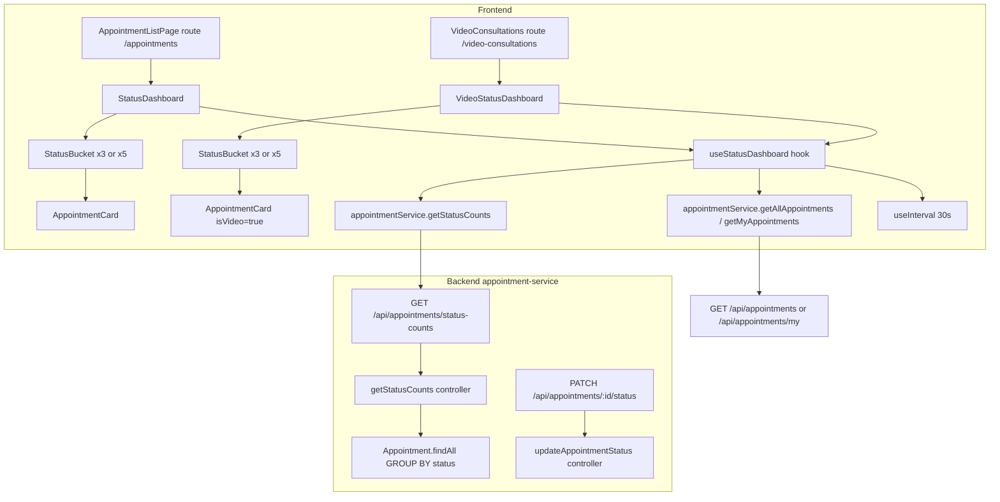

# Design Document

## Appointment Status Tracking

---

## Overview

This feature redesigns the appointment management UI from a flat tab-based list into a horizontal kanban-style status bucket layout, and adds a matching layout to the video consultations page. Each status bucket shows a count badge and a scrollable list of appointment cards. Role-based visibility rules determine which buckets each user sees. A new backend endpoint provides efficient status count aggregation. A 30-second polling loop keeps counts fresh without full page reloads.

The existing `AppointmentListPage.jsx` is replaced with a `StatusDashboard` component. The existing `VideoConsultationPage.jsx` (the listing page at `/video-consultations`) is replaced with a `VideoStatusDashboard` component. The actual video call room page (`/video/:roomId`) is unchanged.

### Key Design Decisions

- **Kanban layout over tabs**: Buckets are rendered side-by-side in a horizontally scrollable row, giving staff an at-a-glance view of workload distribution across all statuses simultaneously.
- **Shared `AppointmentCard` component**: Both the clinic dashboard and the video dashboard reuse the same card component, with a `isVideo` prop enabling the "Join Video Call" button and camera icon.
- **Optimistic UI updates**: When a user triggers a status change from a card, the Redux store is updated immediately (before the API response) so the card moves to the correct bucket without waiting for the next poll.
- **Polling via `useInterval`**: A custom `useInterval` hook drives the 30-second refresh of status counts. The full appointment list is fetched once on mount; subsequent polls only refresh counts, not the full list, to minimize payload size.
- **Single `getStatusCounts` endpoint**: Rather than re-fetching all appointments to recount, the new `GET /api/appointments/status-counts` endpoint runs a `GROUP BY status` query and returns both `live` and `cumulative` counts per status in a single response, keeping the payload small while supporting both the live kanban view and the reporting totals.

---

## Architecture



The frontend state is managed in a local `useStatusDashboard` hook (not in Redux) because the dashboard state is page-scoped and does not need to be shared across routes. The hook owns: the appointments array, the counts map, the loading/error state, and the polling interval.

---

## Components and Interfaces

### `StatusDashboard` (replaces `AppointmentListPage`)

**File:** `frontend/src/pages/Appointment/StatusDashboard.jsx`

Props: none (reads role from Redux `auth` slice)

Responsibilities:
- Determines visible buckets based on role (`DOCTOR_BUCKETS` or `STAFF_BUCKETS`)
- Renders a horizontal row of `StatusBucket` components
- Passes the filtered appointment list, `liveCount`, and `cumulativeCount` to each bucket
- Renders the "Book Appointment" button for Admin/Receptionist/Patient

```js
const DOCTOR_BUCKETS = ['In Progress', 'Completed', 'Cancelled'];
const STAFF_BUCKETS  = ['Pending', 'Confirmed', 'In Progress', 'Completed', 'Cancelled'];
```

### `VideoStatusDashboard`

**File:** `frontend/src/pages/VideoConsultation/VideoStatusDashboard.jsx`

Same structure as `StatusDashboard` but:
- Passes `type: 'video'` to all API calls
- Renders `AppointmentCard` with `isVideo={true}`
- Accessible at `/video-consultations` for Doctor; Admin/Receptionist access it from the appointments page

### `StatusBucket`

**File:** `frontend/src/components/appointments/StatusBucket.jsx`

Props:
```ts
{
  status: string,           // e.g. "Pending"
  appointments: Appointment[],
  liveCount: number,        // appointments currently at this status
  cumulativeCount: number,  // appointments that have ever reached this status
  isVideo?: boolean,
  onStatusChange: (id: string, newStatus: string) => void,
  onError: (message: string) => void,
}
```

Responsibilities:
- Renders the bucket header with status label, live count badge (labeled "Now"), and cumulative count (labeled "Total")
- Renders a date filter input (Admin/Receptionist only)
- Renders a scrollable list of `AppointmentCard` components
- Renders the empty-state message when `appointments.length === 0`

### `AppointmentCard`

**File:** `frontend/src/components/appointments/AppointmentCard.jsx`

Props:
```ts
{
  appointment: Appointment,
  role: 'Doctor' | 'Admin' | 'Receptionist',
  isVideo?: boolean,
  onStatusChange: (id: string, newStatus: string) => Promise<void>,
}
```

Responsibilities:
- Renders patient name, doctor name (Admin/Receptionist only), date, time, reason
- Renders `StatusBadge` with the correct color scheme
- Renders inline action buttons based on role + current status
- Renders "Join Video Call" button when `isVideo && status in ['Confirmed', 'In Progress']`
- Renders video camera icon when `isVideo`
- Shows inline error message on API failure (does not move card)

### `StatusBadge`

**File:** `frontend/src/components/appointments/StatusBadge.jsx`

Props: `{ status: string }`

Color mapping:
| Status      | Color scheme |
|-------------|-------------|
| Pending     | Gray         |
| Confirmed   | Blue         |
| In Progress | Amber/Yellow |
| Completed   | Green        |
| Cancelled   | Red          |

### `useStatusDashboard` hook

**File:** `frontend/src/hooks/useStatusDashboard.js`

```ts
function useStatusDashboard(options: {
  type?: 'clinic' | 'video',
  role: string,
  userId: string,
}): {
  appointments: Appointment[],
  counts: Record<string, { live: number; cumulative: number }>,
  loading: boolean,
  error: string | null,
  handleStatusChange: (id: string, newStatus: string) => Promise<void>,
  refetch: () => void,
}
```

Internal behavior:
1. On mount: fetch full appointment list via `getAllAppointments` (Admin/Receptionist) or `getMyAppointments` (Doctor), filtered by `type` if provided.
2. Derive `counts.live` per status from the local appointments array (no separate count fetch on mount). Derive `counts.cumulative` using the cumulative formula (see `getStatusCounts` controller logic).
3. Start `useInterval` at 30 000 ms: call `getStatusCounts({ type })` and update `counts` state with both `live` and `cumulative` values returned by the API.
4. `handleStatusChange`: optimistically update the local `appointments` array status and recalculate both `live` and `cumulative` counts, then call `PATCH /api/appointments/:id/status`. On failure, revert the optimistic update and set an error message.

### `useInterval` hook

**File:** `frontend/src/hooks/useInterval.js`

Standard Dan Abramov `useInterval` implementation using `useRef` to hold the latest callback, clearing and resetting the interval on dependency changes.

---

## Data Models

### Frontend `Appointment` shape (enriched by backend)

```ts
interface Appointment {
  id: string;           // UUID
  patientId: string;
  doctorId: string;
  patientName: string;  // enriched by backend
  doctorName?: string;  // enriched for Admin/Receptionist
  appointmentDate: string;   // YYYY-MM-DD
  appointmentTime: string;   // HH:mm:ss
  reason: string;
  status: 'Pending' | 'Confirmed' | 'In Progress' | 'Completed' | 'Cancelled';
  notes?: string;
  isAdminApproved: boolean;
  type: 'clinic' | 'video';
}
```

### `GET /api/appointments/status-counts` response

```ts
interface StatusCount {
  live: number;        // appointments currently at this status
  cumulative: number;  // appointments that have ever reached this status
}

interface StatusCountsResponse {
  Pending:      StatusCount;
  Confirmed:    StatusCount;
  'In Progress': StatusCount;
  Completed:    StatusCount;
  Cancelled:    StatusCount;
}
```

Query parameters:
- `type` (optional): `'clinic'` | `'video'` — filters counts to that appointment type

**Cumulative count derivation** (no audit/history table required):
| Status      | Cumulative formula                                      |
|-------------|--------------------------------------------------------|
| Pending     | live(Pending) + live(Confirmed) + live(In Progress) + live(Completed) + live(Cancelled) — i.e. all appointments ever created |
| Confirmed   | live(Confirmed) + live(In Progress) + live(Completed)  |
| In Progress | live(In Progress) + live(Completed)                    |
| Completed   | live(Completed)                                        |
| Cancelled   | live(Cancelled)                                        |

### Backend `getStatusCounts` controller logic

```js
// Pseudo-code
const where = {};
if (role === 'Doctor') where.doctorId = req.user.id;
if (type) where.type = type;

const rows = await Appointment.findAll({
  where,
  attributes: ['status', [sequelize.fn('COUNT', sequelize.col('id')), 'count']],
  group: ['status'],
});

// Build live counts with all 5 statuses defaulting to 0
const live = { Pending: 0, Confirmed: 0, 'In Progress': 0, Completed: 0, Cancelled: 0 };
rows.forEach(r => { live[r.status] = parseInt(r.dataValues.count, 10); });

// Derive cumulative counts from live counts (no audit table needed)
const cumulative = {
  Pending:      live.Pending + live.Confirmed + live['In Progress'] + live.Completed + live.Cancelled,
  Confirmed:    live.Confirmed + live['In Progress'] + live.Completed,
  'In Progress': live['In Progress'] + live.Completed,
  Completed:    live.Completed,
  Cancelled:    live.Cancelled,
};

// Build response: each status has { live, cumulative }
const counts = {};
Object.keys(live).forEach(status => {
  counts[status] = { live: live[status], cumulative: cumulative[status] };
});

res.json(counts);
```

### Role-to-bucket mapping

```ts
const BUCKET_CONFIG: Record<string, string[]> = {
  Doctor:       ['In Progress', 'Completed', 'Cancelled'],
  Admin:        ['Pending', 'Confirmed', 'In Progress', 'Completed', 'Cancelled'],
  Receptionist: ['Pending', 'Confirmed', 'In Progress', 'Completed', 'Cancelled'],
};
```

### Inline action matrix

| Role         | Current Status | Available Actions                        |
|--------------|---------------|------------------------------------------|
| Doctor       | Confirmed     | → In Progress                            |
| Doctor       | In Progress   | → Completed                              |
| Doctor       | Completed     | (none)                                   |
| Doctor       | Cancelled     | (none)                                   |
| Admin/Recept | Pending       | → Confirmed, → Cancelled, Approve        |
| Admin/Recept | Confirmed     | → In Progress, → Cancelled               |
| Admin/Recept | In Progress   | → Completed, → Cancelled                 |
| Admin/Recept | Completed     | (none)                                   |
| Admin/Recept | Cancelled     | (none)                                   |

---

## Correctness Properties

*A property is a characteristic or behavior that should hold true across all valid executions of a system — essentially, a formal statement about what the system should do. Properties serve as the bridge between human-readable specifications and machine-verifiable correctness guarantees.*

### Property 1: Doctor dashboard never shows Pending or Confirmed buckets

*For any* user with role `Doctor`, the set of bucket labels rendered by `StatusDashboard` must be exactly `{"In Progress", "Completed", "Cancelled"}` — it must never contain `"Pending"` or `"Confirmed"`.

**Validates: Requirements 1.1**

---

### Property 2: Admin/Receptionist dashboard shows all five buckets

*For any* user with role `Admin` or `Receptionist`, the set of bucket labels rendered by `StatusDashboard` must be exactly `{"Pending", "Confirmed", "In Progress", "Completed", "Cancelled"}`.

**Validates: Requirements 1.2**

---

### Property 3: Live count equals card count in each bucket

*For any* list of appointments and any status value, the `liveCount` displayed in a bucket header must equal the number of `AppointmentCard` components rendered inside that bucket.

**Validates: Requirements 1.3a, 3.6**

---

### Property 4: Doctor scoping — only own appointments counted

*For any* Doctor user and any appointment dataset containing appointments with mixed `doctorId` values, the counts shown in the dashboard must equal the counts of appointments where `doctorId === user.id` only.

**Validates: Requirements 1.4, 5.2**

---

### Property 5: Status counts API always returns all five keys with live and cumulative

*For any* appointment dataset and any optional `type` filter, the `GET /api/appointments/status-counts` response object must always contain exactly the five keys: `Pending`, `Confirmed`, `In Progress`, `Completed`, `Cancelled`, and each key must have both a `live` and a `cumulative` sub-field (defaulting to `0` for statuses with no matching appointments).

**Validates: Requirements 5.5, 11.9**

---

### Property 6: Type filter isolates video appointments in counts

*For any* appointment dataset containing a mix of `clinic` and `video` appointments, calling `GET /api/appointments/status-counts?type=video` must return counts that sum to exactly the number of `video`-type appointments in the dataset, and calling with `type=clinic` must sum to exactly the number of `clinic`-type appointments.

**Validates: Requirements 5.4, 6.3**

---

### Property 7: A card appears in exactly one bucket matching its status

*For any* appointment and any rendered `StatusDashboard`, the appointment's card must appear in exactly one bucket — the bucket whose label matches the appointment's `status` — and must not appear in any other bucket.

**Validates: Requirements 3.1, 3.2, 3.3, 3.4, 3.5**

---

### Property 8: Status update moves card to correct bucket

*For any* appointment currently in bucket A, after a status update to a new status B (where B is visible to the current role), the card must appear in bucket B and must no longer appear in bucket A within the same render cycle.

**Validates: Requirements 3.1, 3.2, 3.3, 3.4, 3.5, 3.6**

---

### Property 9: Video bucket contains only video-type appointments

*For any* appointment dataset, the `VideoStatusDashboard` must only render cards for appointments where `type === 'video'`, and must never render cards for appointments where `type === 'clinic'`.

**Validates: Requirements 6.1, 6.2, 6.3**

---

### Property 10: Join Video Call button visibility matches eligibility

*For any* video appointment, the "Join Video Call" button must be present if and only if the appointment's status is `Confirmed` or `In Progress`. For any other status (`Pending`, `Completed`, `Cancelled`), the button must not be rendered.

**Validates: Requirements 7.1, 7.2**

---

### Property 11: Appointment card always displays required fields

*For any* appointment object with valid `patientName`, `appointmentDate`, `appointmentTime`, and `reason` fields, the rendered `AppointmentCard` must contain all four of those values in its output.

**Validates: Requirements 2.1, 2.7**

---

### Property 12: Date filter count equals filtered appointment count

*For any* status bucket and any date filter value, the `Status_Counter` displayed after applying the filter must equal the number of appointments in that bucket whose `appointmentDate` matches the filter value.

**Validates: Requirements 10.3**

---

### Property 13: Clearing date filter restores full bucket

*For any* status bucket, applying a date filter and then clearing it must result in the bucket displaying the same set of appointments as before the filter was applied (round-trip property).

**Validates: Requirements 10.4**

---

### Property 14: Default sort order is ascending by date then time

*For any* unsorted list of appointments in a bucket, the rendered order must be ascending by `appointmentDate` first, then by `appointmentTime` for appointments on the same date.

**Validates: Requirements 10.2**

---

### Property 15: Cumulative count is always ≥ live count

*For any* appointment dataset and any status, the `cumulative` count returned for that status must be greater than or equal to the `live` count for that status. A cumulative count can never be less than the live count because it includes the live count in its derivation.

**Validates: Requirements 11.2, 11.3, 11.4, 11.5, 11.6**

---

### Property 16: Cumulative Pending equals total appointment count

*For any* appointment dataset (with optional type filter applied), the `cumulative` count for `Pending` must equal the total number of appointments in the dataset (within scope), since every appointment starts as Pending.

**Validates: Requirements 11.2**

---

### Property 17: Cumulative count is monotonically non-increasing along the lifecycle

*For any* appointment dataset, the cumulative counts must satisfy: `cumulative(Pending) ≥ cumulative(Confirmed) ≥ cumulative(In Progress) ≥ cumulative(Completed)`. Cancelled is independent of this chain.

**Validates: Requirements 11.3, 11.4, 11.5**

---

## Error Handling

### API failures on status update

When `PATCH /api/appointments/:id/status` fails:
1. The optimistic update is reverted — the appointment's status in local state is restored to its previous value.
2. The card moves back to its original bucket.
3. An inline error message is displayed on the card (not a toast, not a modal) so the user can see which card failed.
4. The error clears on the next successful status update or page refetch.

### Polling failures

When `GET /api/appointments/status-counts` fails during a polling cycle:
- The existing counts are retained (stale counts are better than blank counts).
- No loading spinner is shown.
- A subtle non-blocking error indicator (e.g., a small warning icon in the dashboard header) can optionally be shown after 3 consecutive failures.

### Initial load failure

When the initial appointment fetch fails:
- An `Alert` component (MUI severity="error") is shown in place of the bucket layout.
- A "Retry" button triggers `refetch()`.

### Unauthenticated access to status-counts endpoint

The `GET /api/appointments/status-counts` route is protected by the `protect` middleware. Requests without a valid JWT receive HTTP 401. The frontend `appointmentService` propagates the 401 as a rejected promise, which the hook catches and sets as an error state.

---

## Testing Strategy

### Unit tests (example-based)

- `StatusBadge`: verify each of the 5 statuses renders the correct color class
- `AppointmentCard` (Doctor role): verify "Start Consultation" button appears for `Confirmed` status
- `AppointmentCard` (Doctor role): verify "Mark as Completed" button appears for `In Progress` status
- `AppointmentCard` (Doctor role): verify no Pending/Confirmed transition buttons appear
- `AppointmentCard` (Admin role): verify all valid transition buttons appear at each status
- `AppointmentCard` (video): verify "Join Video Call" button navigates to `/video/:id`
- `AppointmentCard` (video): verify video camera icon is rendered
- `useStatusDashboard`: verify polling interval is set to ≤ 30 000 ms
- `getStatusCounts` controller: verify HTTP 401 for unauthenticated request

### Property-based tests

Property-based testing is appropriate here because the core logic — bucket assignment, count derivation, role-based filtering, and sort ordering — are pure functions over structured data. The input space (appointment lists, role values, status values) is large and varied, making randomized testing valuable for catching edge cases.

**Library:** [fast-check](https://github.com/dubzzz/fast-check) (JavaScript/TypeScript)

**Minimum iterations:** 100 per property test

**Tag format:** `// Feature: appointment-status-tracking, Property N: <property_text>`

Properties to implement as property-based tests:

| Property | Test target | What varies |
|----------|------------|-------------|
| P1 | `getBuckets(role)` pure function | Role value |
| P2 | `getBuckets(role)` pure function | Role value |
| P3 | `deriveLiveCounts(appointments)` pure function | Appointment list |
| P4 | `filterByDoctor(appointments, userId)` pure function | Appointment list, userId |
| P5 | `getStatusCounts` controller (mocked DB) | Appointment dataset |
| P6 | `getStatusCounts` controller with type filter | Dataset, type param |
| P7 | `getAppointmentsForBucket(appointments, status)` | Appointment list, status |
| P8 | `applyStatusUpdate(appointments, id, newStatus)` | Appointment list, id, newStatus |
| P9 | `filterByType(appointments, 'video')` | Appointment list |
| P10 | `shouldShowJoinButton(status, isVideo)` | Status, isVideo |
| P11 | `AppointmentCard` render (React Testing Library) | Appointment object |
| P12 | `applyDateFilter(appointments, date)` count | Appointment list, date |
| P13 | `applyDateFilter` then clear (round-trip) | Appointment list, date |
| P14 | `sortAppointments(appointments)` | Unsorted appointment list |
| P15 | `deriveCumulativeCounts(liveCounts)` — cumulative ≥ live | Live counts map |
| P16 | `deriveCumulativeCounts(liveCounts)` — Pending cumulative = total | Live counts map |
| P17 | `deriveCumulativeCounts(liveCounts)` — monotonic ordering | Live counts map |

### Integration tests

- `GET /api/appointments/status-counts` returns correct counts for a seeded dataset (Doctor scope)
- `GET /api/appointments/status-counts` returns correct counts for a seeded dataset (Admin scope)
- `GET /api/appointments/status-counts?type=video` returns only video counts
- `PATCH /api/appointments/:id/status` triggers optimistic UI update and reverts on failure

### Smoke tests

- `GET /api/appointments/status-counts` responds with HTTP 200 for authenticated request
- `GET /api/appointments/status-counts` responds with HTTP 401 for unauthenticated request
- `/video-consultations` route renders `VideoStatusDashboard` component
- Sidebar renders correct nav items for Doctor, Admin, and Receptionist roles
