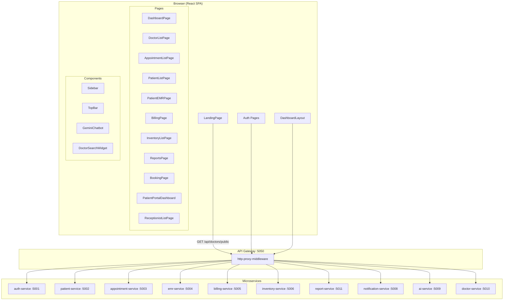
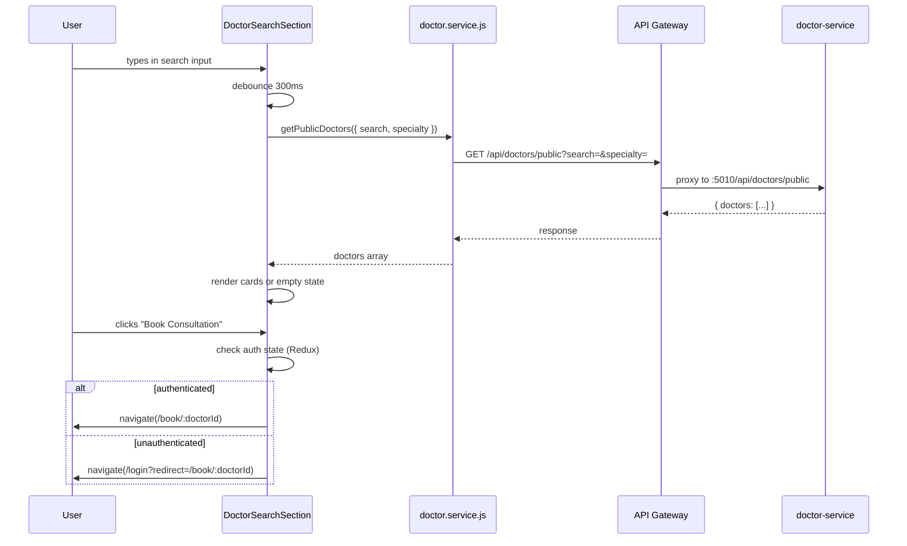
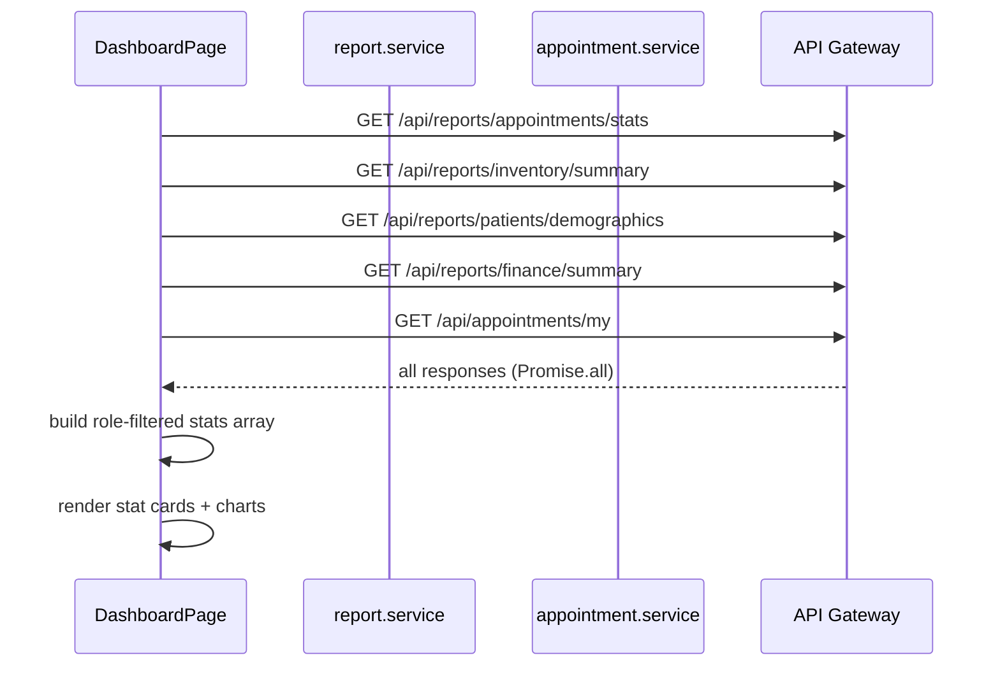
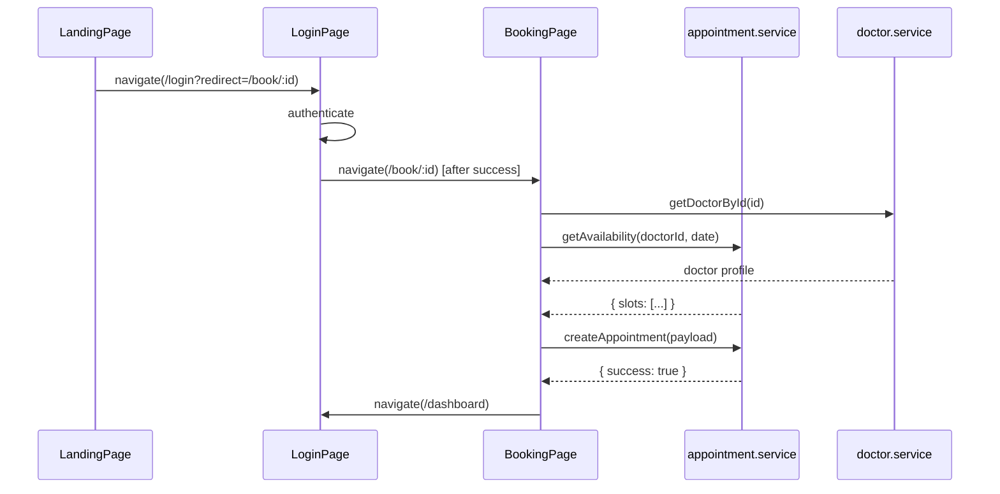

# Design Document: Clinical System UI Overhaul — Biruh Tena (ብሩህ ጤና)

## Overview

This overhaul transforms the existing "Clinical Hub" frontend from a dental-branded prototype into a polished, Ethiopian-flavored clinical management system called **Biruh Tena** (ብሩህ ጤና — "Bright Health"). The redesign covers the public landing page, all authenticated pages, branding tokens, typography, and integration wiring across all microservices. The goal is visual excellence, Ethiopian cultural identity, live API-driven content, and airtight role-based access on every route.

The system is a React + Vite + Tailwind CSS + MUI + Framer Motion SPA backed by nine Node.js microservices proxied through a single API gateway. All changes are purely frontend except for one minor backend concern: the `GET /api/doctors/public` endpoint must support `?search=` and `?specialty=` query params for the landing page doctor search feature.

---

## Architecture

### System Component Diagram



### Route & Role Access Matrix

| Route | Admin | Doctor | Receptionist | Patient | Public |
|---|---|---|---|---|---|
| `/` | ✅ | ✅ | ✅ | ✅ | ✅ |
| `/login`, `/register`, `/forgot-password` | ✅ | ✅ | ✅ | ✅ | ✅ |
| `/dashboard` | ✅ | ✅ | ✅ | ✅ (portal) | ❌ |
| `/doctors` | ✅ | ✅ | ✅ | ❌ | ❌ |
| `/appointments` | ✅ | ✅ | ✅ | ✅ | ❌ |
| `/patients` | ✅ | ✅ | ✅ | ✅ (own) | ❌ |
| `/emr` | ✅ | ✅ | ❌ | ✅ (own) | ❌ |
| `/billing` | ✅ | ❌ | ✅ | ✅ (own) | ❌ |
| `/inventory` | ✅ | ❌ | ✅ | ❌ | ❌ |
| `/reports` | ✅ | ❌ | ❌ | ❌ | ❌ |
| `/receptionists` | ✅ | ❌ | ❌ | ❌ | ❌ |
| `/book/:doctorId` | ✅ | ❌ | ✅ | ✅ | ❌ |
| `/profile`, `/settings` | ✅ | ✅ | ✅ | ✅ | ❌ |

**Current gap**: `/doctors` is accessible to Patient role in the sidebar — it should be hidden. `/billing` is not in the Patient sidebar but the route is unguarded. These need role guards added to both the sidebar `NAV_BY_ROLE` map and a `RoleGuard` wrapper component.

---

## Landing Page Section Architecture

The redesigned landing page is a single-file component (`LandingPage.jsx`) composed of 11 discrete sections rendered in order. Each section is a named sub-component or clearly delimited JSX block.

```mermaid
graph TD
    LP[LandingPage.jsx]
    LP --> NAV[1. NavBar — sticky glassmorphism]
    LP --> HERO[2. HeroSection — full-screen animated]
    LP --> STATS[3. StatsBar — 4 counters]
    LP --> SERVICES[4. ServicesGrid — 6 clinical specialties]
    LP --> DOCTORS[5. DoctorSearchSection — live search + cards]
    LP --> HOW[6. HowItWorks — 3-step process]
    LP --> TESTIMONIALS[7. Testimonials — patient reviews carousel]
    LP --> ABOUT[8. AboutTech — technology & mission]
    LP --> FAQ[9. FAQAccordion — expandable Q&A]
    LP --> EMERGENCY[10. EmergencyBanner — 24/7 contact strip]
    LP --> FOOTER[11. Footer — contact, social, links, insurance logos]
```



### Section Specifications

**1. NavBar**
- Sticky, `position: fixed`, `z-50`
- Transparent on top → glassmorphism (`backdrop-blur-md bg-white/70`) on scroll
- Logo: Stethoscope icon + "Biruh Tena" in Playfair Display + "ብሩህ ጤና" subtitle in small Ethiopic script
- Links: Services, Doctors, About, FAQ, Emergency
- CTA button: "Patient Portal" → `/login`
- Mobile: hamburger → full-screen overlay menu

**2. HeroSection**
- Full viewport height (`min-h-screen`)
- Left column: badge, H1 headline, subtext, two CTAs ("Book Appointment" scrolls to doctors, "Learn More" scrolls to about)
- Right column: hero image with floating stat cards (rating badge, "Available Now" pill)
- Background: subtle teal-to-amber gradient mesh, animated floating blobs via Framer Motion

**3. StatsBar**
- Dark teal background (`#0d4f4a`)
- 4 animated counters: Patients Served, Expert Doctors, Clinic Locations, Years of Excellence
- Numbers animate up on viewport entry using `useInView` + `useMotionValue`

**4. ServicesGrid**
- 6 cards in a 2×3 or 3×2 grid
- Specialties: General Medicine, Pediatrics, Gynecology & Obstetrics, Surgery, Dermatology, Ophthalmology
- Each card: icon, title, description, "Learn More" link
- Hover: card lifts, border turns teal

**5. DoctorSearchSection** ← new feature
- Search bar (name or specialty text input) + specialty dropdown filter
- Debounced input (300ms) calls `GET /api/doctors/public?search=&specialty=`
- Results displayed as 3-column card grid (same card design as current, updated branding)
- Loading skeleton cards while fetching
- Empty state: "No doctors found" illustration
- Each card has "Book Consultation" button → `/login?redirect=/book/:id` if unauthenticated, `/book/:id` if authenticated

**6. HowItWorks**
- 3 steps: Register / Search Doctor → Book Appointment → Receive Care
- Horizontal step flow on desktop, vertical on mobile
- Step cards flip color on hover (teal background, white text)

**7. Testimonials**
- Carousel (Swiper.js — already in `package.json`)
- 5–6 static testimonial objects (name, role, text, avatar initial, star rating)
- Auto-play, loop, pagination dots

**8. AboutTech**
- Two-column: image left, text right
- Highlights: AI-assisted diagnostics, digital records, multi-specialty care
- Replaces dental-specific copy with general clinical copy

**9. FAQAccordion**
- 6–8 Q&A pairs using a custom accordion (no external dependency needed)
- Animated expand/collapse via Framer Motion `AnimatePresence`
- Topics: booking process, insurance, emergency care, patient records, pricing

**10. EmergencyBanner**
- Full-width amber/red strip
- "24/7 Emergency Line: +251 911 22 33 44"
- Pulsing red dot animation

**11. Footer**
- 4-column grid: brand + tagline, quick links, contact info, social + insurance logos
- Insurance/partner logos row (placeholder SVG badges)
- Copyright line

---

## Doctor Search Component Design



### DoctorSearchSection Component Interface

```typescript
interface Doctor {
  id: string
  fullName: string
  specialization: string
  experience: number
  rating: number
  reviewsCount: number
  profilePhoto: string | null
  bio: string | null
  isActive: boolean
}

interface DoctorSearchSectionProps {
  // self-contained, no props needed — fetches own data
}

// Internal state shape
interface DoctorSearchState {
  query: string           // text input value
  specialty: string       // dropdown value, '' = all
  doctors: Doctor[]
  loading: boolean
  error: string | null
}
```

### Specialty Options (replaces dental specialties)

```
All Specialties | General Medicine | Pediatrics | Gynecology & Obstetrics
Surgery | Dermatology | Ophthalmology | Cardiology | Orthopedics | Psychiatry
```

### Backend Query Param Support Required

The `GET /api/doctors/public` endpoint in `doctor-service` must be updated to accept:
- `?search=<string>` — case-insensitive LIKE match on `fullName` and `specialization`
- `?specialty=<string>` — exact match on `specialization`

This is a small addition to the existing Sequelize query in `doctorController.js`.

---

## Data Flow Diagrams

### Dashboard Data Flow (All Roles)



**Current issue**: `treatmentData` in `DashboardPage` is hardcoded with dental labels (`Root Canal`, `Braces`). This must be replaced with generic clinical categories fetched from the report service, or replaced with a generic placeholder until the report service exposes a treatment breakdown endpoint.

### Booking Flow



**Current issue**: `BookingPage` is inside `<ProtectedRoute>` which redirects to `/login` without preserving the `redirect` param. The `LoginPage` must read `?redirect=` from the URL and navigate there after successful login. The `ProtectedRoute` component must pass the current path as the redirect param.

---

## Color System & Typography Scale

### Color Palette

| Token | Hex | Usage |
|---|---|---|
| `--color-primary` | `#0d9488` | Primary teal — buttons, links, active states |
| `--color-primary-dark` | `#0f766e` | Hover states, pressed buttons |
| `--color-primary-light` | `#ccfbf1` | Backgrounds, chips, badges |
| `--color-accent` | `#f59e0b` | Amber — CTAs, highlights, emergency |
| `--color-accent-dark` | `#d97706` | Amber hover |
| `--color-surface` | `#f8fafc` | Page background |
| `--color-card` | `#ffffff` | Card backgrounds |
| `--color-border` | `#e2e8f0` | Default borders |
| `--color-text-primary` | `#0f172a` | Headings |
| `--color-text-secondary` | `#64748b` | Body, captions |
| `--color-sidebar-from` | `#0a2540` | Sidebar gradient start |
| `--color-sidebar-to` | `#0d4f4a` | Sidebar gradient end (teal) |
| `--color-emergency` | `#dc2626` | Emergency banner, critical alerts |

The MUI theme in `App.jsx` must be updated: `primary.main` → `#0d9488`, `primary.dark` → `#0f766e`, `primary.light` → `#ccfbf1`.

The `index.css` `--primary-blue` variable and `.text-gradient` utility must be updated to use teal-to-emerald instead of blue-to-indigo.

### Typography Scale

| Role | Font | Weight | Size |
|---|---|---|---|
| Display / Hero H1 | Playfair Display | 900 | `clamp(3rem, 7vw, 5.5rem)` |
| Section H2 | Playfair Display | 700 | `clamp(2rem, 4vw, 3.5rem)` |
| Card H3 | Inter | 800 | `1.5rem` |
| Body | Inter | 400–500 | `1rem` / `0.875rem` |
| Caption / Label | Inter | 600–700 | `0.75rem` |
| Ethiopic subtitle | Noto Serif Ethiopic | 400 | `0.875rem` |

Google Fonts import to add to `index.html`:
```html
<link rel="preconnect" href="https://fonts.googleapis.com">
<link href="https://fonts.googleapis.com/css2?family=Playfair+Display:wght@700;900&family=Inter:wght@400;500;600;700;800&family=Noto+Serif+Ethiopic:wght@400;600&display=swap" rel="stylesheet">
```

The `body` font-family in `index.css` stays as Inter. Playfair Display is applied via a `.font-display` Tailwind utility class added to the `@layer utilities` block.

---

## Components and Interfaces

### Updated Sidebar

The sidebar gradient changes from `#0f172a → #1e3a5f` (blue-navy) to `#0a2540 → #0d4f4a` (navy-to-teal). The logo area shows:
- Icon: Stethoscope in teal
- Primary text: "Biruh Tena" (Inter Bold)
- Secondary text: "ብሩህ ጤና" (Noto Serif Ethiopic, teal-300)

The `NAV_BY_ROLE.Patient` array must remove the `/patients` "My Identity" link — patients should not see a patients list route. The `/billing` route must be added to the Patient nav as "My Bills".

### RoleGuard Component (new)

A new `<RoleGuard allowedRoles={[]} />` wrapper component sits inside `ProtectedRoute` for routes that need role-level enforcement beyond just authentication:

```typescript
interface RoleGuardProps {
  allowedRoles: ('Admin' | 'Doctor' | 'Receptionist' | 'Patient')[]
  children: React.ReactNode
  fallback?: React.ReactNode  // defaults to <Navigate to="/dashboard" />
}
```

Routes that need this guard: `/doctors` (not Patient), `/reports` (Admin only), `/receptionists` (Admin only), `/inventory` (Admin + Receptionist), `/emr` (not Receptionist).

### Updated DashboardPage

The hardcoded `treatmentData` array (`Root Canal`, `Braces`, `Cleaning`) must be replaced with generic clinical categories. Until the report service exposes a treatment breakdown endpoint, use:

```javascript
const treatmentData = [
  { name: 'General Consultation', value: 40 },
  { name: 'Surgical Procedure', value: 20 },
  { name: 'Pediatric Care', value: 25 },
  { name: 'Other', value: 15 },
]
```

The appointment card fallback text `'Dental Consultation'` in `PatientPortalDashboard` must change to `'General Consultation'`.

### Updated PatientPortalDashboard

The "Daily Health Tip" card content must be replaced with a rotating array of general health tips (hydration, sleep, exercise, nutrition) instead of the dental-specific floss tip. A `useMemo` with `Math.floor(Date.now() / 86400000) % tips.length` gives a stable daily rotation.

---

## Integration Gaps & Fixes

| # | Gap | Location | Fix |
|---|---|---|---|
| 1 | Mock doctors shown on landing page when API fails | `LandingPage.jsx` L56 `displayDoctors` | Remove `mockDoctors` fallback; show empty state or skeleton instead |
| 2 | No search/filter on landing page doctor section | `LandingPage.jsx` | Add `DoctorSearchSection` with debounced query params |
| 3 | `BookingPage` redirect param not preserved | `App.jsx` `ProtectedRoute` | Pass `?redirect=` in `<Navigate to="/login" state={{ from: location }} />` and read in `LoginPage` |
| 4 | Dental copy in `DashboardPage` treatment chart | `DashboardPage.jsx` L79–84 | Replace hardcoded dental labels with generic clinical labels |
| 5 | Dental copy in `PatientPortalDashboard` | `PatientPortalDashboard.jsx` L113, L148 | Replace "Dental Specialist" and floss tip |
| 6 | Patient can navigate to `/doctors` via URL | `App.jsx` | Wrap `/doctors` route with `<RoleGuard allowedRoles={['Admin','Doctor','Receptionist']} />` |
| 7 | `/billing` not in Patient sidebar | `Sidebar.jsx` `NAV_BY_ROLE.Patient` | Add billing link for Patient role |
| 8 | `GET /api/doctors/public` has no search/specialty params | `doctor-service` controller | Add Sequelize `where` clause with `Op.iLike` for search and specialty filter |
| 9 | MUI theme uses blue as primary | `App.jsx` theme | Update `primary.main` to `#0d9488` |
| 10 | `BookingPage` has dental copy in checklist items | `BookingPage.jsx` L108–109 | Replace "Digital X-ray" / "Board certified" with general clinical copy |
| 11 | Footer email is `hello@rasdental.com` | `LandingPage.jsx` | Update to `hello@biruhtena.et` |
| 12 | Hero badge says "Dental Excellence & Technology" | `LandingPage.jsx` | Replace with "Ethiopian Clinical Excellence" |

---

## Error Handling

### Doctor Search Empty / Error States

- API error → show inline alert banner with retry button; do not show stale mock data
- Empty results → illustration + "No doctors found for your search. Try a different specialty."
- Loading → 3 skeleton cards (animated pulse)

### Booking Redirect After Login

- If `LoginPage` receives `state.from` or `?redirect=` query param, navigate there after successful login
- If the redirect target is `/book/:id` and the doctor no longer exists, `BookingPage` shows a "Doctor not found" error with a back button

### Role Guard Fallback

- If a user navigates to a forbidden route, `RoleGuard` renders `<Navigate to="/dashboard" replace />` — no error page, silent redirect

---

## Testing Strategy

### Unit Testing Approach

Each new/modified component should have tests covering:
- `DoctorSearchSection`: debounce fires after 300ms, empty state renders when `doctors=[]`, skeleton renders when `loading=true`
- `RoleGuard`: renders children for allowed roles, redirects for disallowed roles
- `LandingPage` sections: each section renders without crashing, nav links have correct `href` values

### Property-Based Testing Approach

**Property Test Library**: fast-check (add as dev dependency)

Properties to verify:
- For any non-empty `doctors` array returned by the API, the rendered card count equals `Math.min(doctors.length, 3)` on the landing page
- For any `role` in `['Admin','Doctor','Receptionist','Patient']`, the sidebar nav items are a non-empty subset of the full nav definition
- For any `query` string, the debounced search never fires more than once per 300ms window

### Integration Testing Approach

- Verify `GET /api/doctors/public?search=ali` returns only doctors whose name contains "ali" (case-insensitive)
- Verify `ProtectedRoute` redirects unauthenticated users to `/login?redirect=<current-path>`
- Verify `LoginPage` navigates to the `redirect` param after successful authentication

---

## Performance Considerations

- Playfair Display and Noto Serif Ethiopic fonts are loaded with `display=swap` to prevent FOIT
- Doctor search uses a 300ms debounce to avoid hammering the API on every keystroke
- Landing page sections use `whileInView` with `once: true` so animations only fire once
- Hero image should be served as WebP with a JPEG fallback; the existing `clinic-hero.png` should be converted
- The Swiper testimonials carousel uses `lazy` loading for avatar images

## Security Considerations

- The `GET /api/doctors/public` endpoint must remain unauthenticated (no JWT required) — it is intentionally public for the landing page
- The `RoleGuard` is a UI-only guard; all backend endpoints already enforce JWT + role middleware — the frontend guard is UX, not security
- The `?redirect=` param in the login URL must be validated to only allow relative paths (prevent open redirect): `redirect.startsWith('/') && !redirect.startsWith('//')` 

## Dependencies

All required packages are already in `package.json`:
- `framer-motion` — animations
- `swiper` — testimonials carousel
- `lucide-react` — icons
- `@mui/material` — component library
- `tailwindcss` — utility CSS
- `react-redux` — auth state

New additions needed:
- Google Fonts: Playfair Display, Noto Serif Ethiopic (via `index.html` link tag — no npm package)
- `fast-check` (dev dependency) — property-based testing

---

## Correctness Properties

*A property is a characteristic or behavior that should hold true across all valid executions of a system — essentially, a formal statement about what the system should do. Properties serve as the bridge between human-readable specifications and machine-verifiable correctness guarantees.*

### Property 1: Debounced search fires at most once per 300ms window

For any sequence of keystrokes typed into the DoctorSearchSection search input, the API call to `GET /api/doctors/public` SHALL be triggered at most once within any 300-millisecond window, regardless of how many characters are typed.

**Validates: Requirement 6.2**

---

### Property 2: Doctor search API params always include both search and specialty

For any combination of search query string and specialty filter value (including empty strings), the DoctorSearchSection SHALL always include both `search` and `specialty` as query parameters in the API request.

**Validates: Requirement 6.3**

---

### Property 3: Unauthenticated booking redirect preserves doctor ID

For any doctor ID present in the doctor cards, when an unauthenticated visitor clicks "Book Consultation", the System SHALL navigate to `/login?redirect=/book/<doctorId>` where `<doctorId>` exactly matches the doctor's ID from the card.

**Validates: Requirement 6.7**

---

### Property 4: Authenticated booking navigates directly to booking page

For any doctor ID present in the doctor cards, when an authenticated user clicks "Book Consultation", the System SHALL navigate directly to `/book/<doctorId>` without passing through the login page.

**Validates: Requirement 6.8**

---

### Property 5: RoleGuard allows access for all roles in allowedRoles

For any role value in `['Admin', 'Doctor', 'Receptionist', 'Patient']` and any `allowedRoles` array that contains that role, the RoleGuard SHALL render its children without redirecting.

**Validates: Requirement 14.1**

---

### Property 6: RoleGuard redirects all roles not in allowedRoles

For any role value in `['Admin', 'Doctor', 'Receptionist', 'Patient']` and any `allowedRoles` array that does NOT contain that role, the RoleGuard SHALL redirect to `/dashboard` and SHALL NOT render its children.

**Validates: Requirement 14.2**

---

### Property 7: Sidebar nav items are non-empty for every valid role

For any role in `['Admin', 'Doctor', 'Receptionist', 'Patient']`, the `NAV_BY_ROLE` configuration SHALL return a non-empty array of navigation items.

**Validates: Requirement 14.8, Requirement 14.9**

---

### Property 8: ProtectedRoute redirect encodes the full current path

For any protected route path, when an unauthenticated user attempts to access it, the ProtectedRoute SHALL redirect to `/login` with a `redirect` query parameter whose value exactly equals the attempted path.

**Validates: Requirement 15.1**

---

### Property 9: LoginPage redirect round-trip preserves destination

For any valid relative path (starts with `/` and does not start with `//`) passed as the `redirect` query parameter, after successful authentication the LoginPage SHALL navigate the user to exactly that path.

**Validates: Requirement 15.2**

---

### Property 10: LoginPage rejects non-relative redirect values

For any redirect parameter value that does not start with `/` or that starts with `//`, the LoginPage SHALL navigate to `/dashboard` instead of the provided redirect value.

**Validates: Requirement 15.3**

---

### Property 11: Doctor search name filter is case-insensitive and substring-matching

For any search string `s` and any doctor whose `fullName` or `specialization` contains `s` as a substring (case-insensitive), the Doctor_Service SHALL include that doctor in the results of `GET /api/doctors/public?search=<s>`.

**Validates: Requirement 17.1**

---

### Property 12: Doctor search specialty filter returns exact matches only

For any specialty string `sp`, every doctor returned by `GET /api/doctors/public?specialty=<sp>` SHALL have a `specialization` field that exactly equals `sp`, and no doctor with a different specialization SHALL appear in the results.

**Validates: Requirement 17.2**

---

### Property 13: Combined search and specialty filters are both applied

For any combination of search string `s` and specialty string `sp`, every doctor returned by `GET /api/doctors/public?search=<s>&specialty=<sp>` SHALL satisfy both the name/specialization substring match for `s` AND the exact specialization match for `sp`.

**Validates: Requirement 17.3**

---

### Property 14: AboutTech section contains no dental-specific copy

For any render of the AboutTech section, the rendered output SHALL NOT contain any of the following dental-specific terms: "dental", "Dental", "tooth", "teeth", "orthodontic", "braces", "root canal", "floss".

**Validates: Requirement 9.1**
