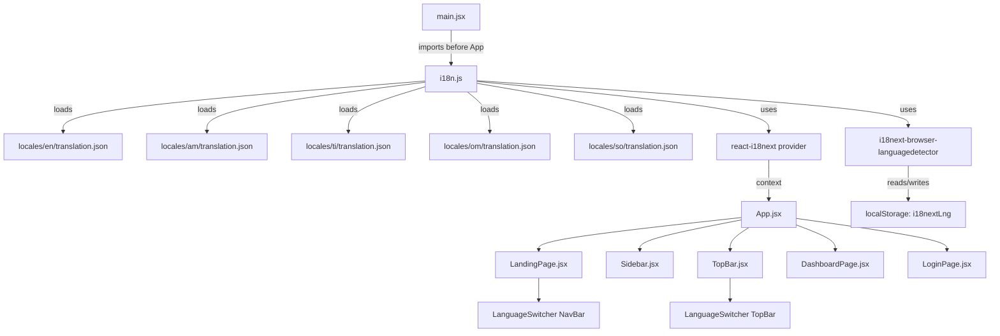

# Design Document: Multi-Language i18n

## Overview

This feature adds full internationalization (i18n) support to the Biruh Tena clinical management system, enabling the UI to render in five languages: English (en), Amharic (am), Tigrinya (ti), Afan Oromo (om), and Somali (so). All UI text currently hardcoded in JSX files will be externalized into per-language JSON translation files and accessed through the `t()` function provided by `react-i18next`.

The implementation is purely frontend — no backend changes are required. Language preference is persisted in `localStorage` and auto-detected from the browser on first visit. Ethiopic-script languages (Amharic, Tigrinya) trigger a CSS font class switch to `Noto Serif Ethiopic` for correct rendering.

### Goals

- Zero hardcoded UI strings in JSX after migration
- Instant language switching without page reload
- Persistent language preference across sessions
- Correct Ethiopic script rendering for `am` and `ti`
- Graceful fallback to English for any missing translation key

### Non-Goals

- Backend API response translation (error messages from the server remain in English)
- Right-to-left (RTL) layout support (none of the five languages require RTL)
- Dynamic loading of translation files (all locales are bundled at build time)

---

## Architecture

The i18n system is initialized once at application startup and made available globally via React context. All components access translations through the `useTranslation` hook or the `Trans` component from `react-i18next`.



### Language Detection Order

On initialization, `i18next-browser-languagedetector` checks sources in this order:

1. `localStorage` key `i18nextLng` (returning user preference)
2. `navigator.language` (browser default on first visit)
3. Fallback to `en` if neither matches a supported locale

### Font Switching

A `useEffect` in a top-level component (or `i18n.js` `on('languageChanged')` listener) adds/removes the `lang-ethiopic` class on `document.documentElement` whenever the active locale changes to or from `am`/`ti`.

```
am | ti active  →  <html class="lang-ethiopic">
en | om | so    →  <html> (no class)
```

---

## Components and Interfaces

### `frontend/src/i18n.js`

Central configuration module. Imported once in `main.jsx` before `<App />` renders.

```js
i18n
  .use(LanguageDetector)
  .use(initReactI18next)
  .init({
    resources: { en, am, ti, om, so },
    fallbackLng: 'en',
    supportedLngs: ['en', 'am', 'ti', 'om', 'so'],
    detection: {
      order: ['localStorage', 'navigator'],
      caches: ['localStorage'],
    },
    interpolation: { escapeValue: false },
  });
```

The module also registers a `languageChanged` listener that toggles the `lang-ethiopic` class on `document.documentElement`.

### `frontend/src/components/common/LanguageSwitcher.jsx`

A self-contained dropdown component. Renders the active language name in its own script. Uses `i18n.changeLanguage(code)` on selection.

**Props:** none (reads/writes i18n state directly)

**Internal state:** `open: boolean` (dropdown visibility)

**Language list:**

| code | label | flag | ethiopic |
|------|-------|------|----------|
| en | English | 🇬🇧 | false |
| am | አማርኛ | 🇪🇹 | true |
| ti | ትግርኛ | 🇪🇹 | true |
| om | Afaan Oromoo | 🇪🇹 | false |
| so | Soomaali | 🇸🇴 | false |

The active language is highlighted in the open dropdown. The component supports keyboard navigation: `Tab` to focus, `Enter`/`Space` to open, `ArrowUp`/`ArrowDown` to navigate, `Enter` to select, `Escape` to close.

### Integration Points

| File | Change |
|------|--------|
| `main.jsx` | Add `import './i18n.js'` before `ReactDOM.createRoot` |
| `LandingPage.jsx` | Replace all hardcoded strings with `t('key')`, add `<LanguageSwitcher />` in NavBar |
| `Sidebar.jsx` | Replace nav item labels with `t('sidebar.key')`, replace footer text |
| `TopBar.jsx` | Add `<LanguageSwitcher />` in right action area, replace search placeholder and menu items |
| `DashboardPage.jsx` | Replace stat titles, headings, and welcome message with `t('dashboard.key')` |
| `LoginPage.jsx` | Replace form labels, button text, and links with `t('auth.login.key')` |
| `RegisterPage.jsx` | Replace form labels and button text with `t('auth.register.key')` |

---

## Data Models

### Translation File Schema

Each locale file is a flat JSON object with dot-namespaced keys. All five files share the same key set.

```
frontend/src/locales/
  en/translation.json
  am/translation.json
  ti/translation.json
  om/translation.json
  so/translation.json
```

**Key namespace structure:**

| Namespace | Example keys |
|-----------|-------------|
| `nav` | `nav.services`, `nav.doctors`, `nav.patientPortal` |
| `hero` | `hero.headline`, `hero.bookBtn`, `hero.learnBtn` |
| `stats` | `stats.patients`, `stats.doctors` |
| `services` | `services.label`, `services.generalMedicine` |
| `doctors` | `doctors.searchPlaceholder`, `doctors.bookBtn`, `doctors.noResults` |
| `howItWorks` | `howItWorks.step1Title`, `howItWorks.step1Desc` |
| `testimonials` | `testimonials.label`, `testimonials.heading` |
| `faq` | `faq.label`, `faq.heading` |
| `emergency` | `emergency.label`, `emergency.callBtn` |
| `footer` | `footer.tagline`, `footer.copyright` |
| `auth` | `auth.login.title`, `auth.register.submit` |
| `dashboard` | `dashboard.welcome`, `dashboard.totalPatients` |
| `sidebar` | `sidebar.dashboard`, `sidebar.patients` |
| `common` | `common.loading`, `common.save`, `common.signOut` |

**Interpolation example:**

```json
{ "dashboard.welcome": "Welcome back, {{name}}" }
```

Used as: `t('dashboard.welcome', { name: user.fullName })`

**Pluralization example:**

```json
{
  "appointments.count_one": "{{count}} appointment",
  "appointments.count_other": "{{count}} appointments"
}
```

### i18next Instance Shape

```ts
interface I18nConfig {
  resources: Record<LocaleCode, { translation: Record<string, string> }>;
  fallbackLng: 'en';
  supportedLngs: ['en', 'am', 'ti', 'om', 'so'];
  detection: {
    order: ['localStorage', 'navigator'];
    caches: ['localStorage'];
  };
  interpolation: { escapeValue: false };
}

type LocaleCode = 'en' | 'am' | 'ti' | 'om' | 'so';
```

### CSS Font Class

```css
/* index.css or global stylesheet */
.lang-ethiopic {
  font-family: 'Noto Serif Ethiopic', serif;
}
```

The `Noto Serif Ethiopic` font is already loaded via Google Fonts in the existing codebase (referenced in `Sidebar.jsx`).

---

## Correctness Properties

*A property is a characteristic or behavior that should hold true across all valid executions of a system — essentially, a formal statement about what the system should do. Properties serve as the bridge between human-readable specifications and machine-verifiable correctness guarantees.*

### Property 1: Translation file round-trip integrity

*For any* translation file in any of the five supported locales, serializing the parsed JSON object back to a string and re-parsing it SHALL produce a structurally equivalent object with identical key-value pairs, including Ethiopic script characters.

**Validates: Requirements 10.5**

### Property 2: Fallback for missing keys

*For any* translation key that exists in the English translation file but is absent from a non-English translation file, calling `t(key)` with that non-English locale active SHALL return the English value for that key, never an empty string or the raw key.

**Validates: Requirements 1.3, 10.1**

### Property 3: Key coverage completeness

*For any* key present in the English translation file, that same key SHALL be present in every other translation file (`am`, `ti`, `om`, `so`), ensuring no key is missing across locales.

**Validates: Requirements 2.7**

### Property 4: Interpolation correctness

*For any* translation string containing `{{variable}}` placeholders and any set of substitution values, calling `t(key, values)` SHALL return a string where every placeholder is replaced with its corresponding value and no placeholder tokens remain in the output.

**Validates: Requirements 10.3**

### Property 5: Language switcher updates all text

*For any* component that uses `t()` and any two distinct supported locale codes, switching from one locale to the other SHALL cause every `t()` call in that component to return the value from the new locale's translation file.

**Validates: Requirements 3.3, 9.1**

### Property 6: Ethiopic font class invariant

*For any* locale change event, the presence of the `lang-ethiopic` class on `document.documentElement` SHALL equal `true` if and only if the new active locale is `am` or `ti`.

**Validates: Requirements 7.1, 7.2, 7.3, 7.4**

### Property 7: localStorage persistence round-trip

*For any* valid locale code selected via the language switcher, reading `localStorage.getItem('i18nextLng')` immediately after the change SHALL return that same locale code.

**Validates: Requirements 8.1, 1.6**

---

## Error Handling

### Missing Translation Key

- i18next logs a `console.warn` in development mode when a key is missing from the active locale
- Falls back to the English value; if also missing in English, returns the key string itself
- No UI error is shown to the user

### Invalid localStorage Value

- On initialization, if `localStorage['i18nextLng']` is not in `['en', 'am', 'ti', 'om', 'so']`, the system falls back to `en` and overwrites the stored value
- Handled inside the `i18next-browser-languagedetector` configuration via `supportedLngs` validation

### Translation File Parse Error

- Since all translation files are bundled at build time (static imports), a malformed JSON file will cause a build-time error, not a runtime error
- This is caught during `vite build` before deployment

### Font Loading Failure

- If `Noto Serif Ethiopic` fails to load from Google Fonts, the browser falls back to the system serif font
- Ethiopic characters remain readable; no functional degradation

---

## Testing Strategy

### Unit Tests

Focus on specific behaviors with concrete examples:

- `LanguageSwitcher` renders the active language label correctly
- `LanguageSwitcher` calls `i18n.changeLanguage` with the correct code on selection
- `LanguageSwitcher` highlights the active language in the open dropdown
- `LanguageSwitcher` keyboard navigation: arrow keys cycle through options, Enter selects
- `i18n.js` initialization: `fallbackLng` is `en`, `supportedLngs` contains all five codes
- Font class toggle: `lang-ethiopic` is added for `am`/`ti` and removed for `en`/`om`/`so`
- `t('dashboard.welcome', { name: 'Tigist' })` returns a string containing `'Tigist'`

### Property-Based Tests

Use a property-based testing library (e.g., `fast-check` for JavaScript) with a minimum of 100 iterations per property. Each test is tagged with the corresponding design property.

**Feature: multi-language-i18n, Property 1: Translation file round-trip integrity**
Generate random key-value pairs including Unicode Ethiopic characters, serialize to JSON, parse back, and assert structural equality.

**Feature: multi-language-i18n, Property 2: Fallback for missing keys**
Generate random key strings present in the English file but absent from a generated partial non-English file; assert `t(key)` returns the English value.

**Feature: multi-language-i18n, Property 3: Key coverage completeness**
For each non-English translation file, assert that every key in the English file is also present in that file.

**Feature: multi-language-i18n, Property 4: Interpolation correctness**
Generate random variable names and values; assert that `t(key, vars)` contains each value and contains no `{{...}}` tokens.

**Feature: multi-language-i18n, Property 5: Language switcher updates all text**
Generate pairs of distinct locale codes; assert that after switching, `t(key)` returns the new locale's value for all keys.

**Feature: multi-language-i18n, Property 6: Ethiopic font class invariant**
Generate random locale codes from the supported set; assert `lang-ethiopic` presence matches `locale ∈ {am, ti}`.

**Feature: multi-language-i18n, Property 7: localStorage persistence round-trip**
Generate random valid locale codes; assert `localStorage.getItem('i18nextLng')` equals the selected code after each change.

### Integration Tests

- Full LandingPage render with each of the five locales: assert no raw translation keys (`t.key` pattern) appear in the DOM
- Language switcher in NavBar and TopBar: assert both switchers reflect the same active locale
- Page reload simulation: assert the locale stored in `localStorage` is restored as the active language on re-initialization
