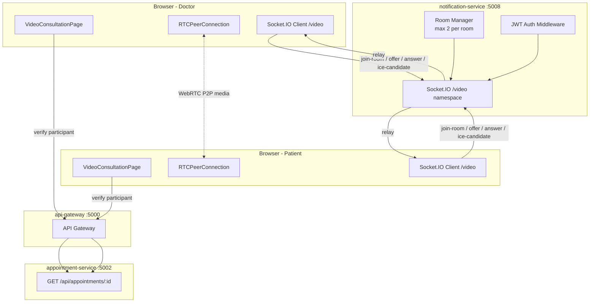
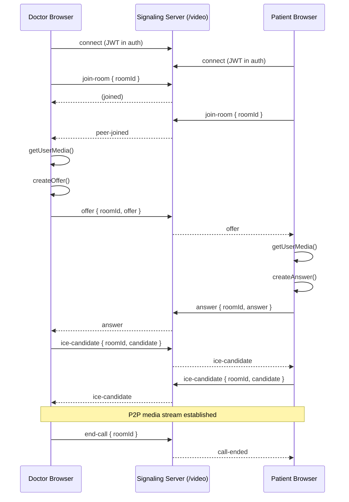

# Design Document: Video Consultation

## Overview

This feature adds browser-native peer-to-peer video consultation to the Biruh Tena clinical management system. Doctors and patients conduct real-time video/audio calls using WebRTC, with Socket.IO handling the signaling exchange. No third-party paid video service is required — the browser's `RTCPeerConnection` API handles all media.

Each confirmed or scheduled appointment automatically has a unique video room identified by the appointment's UUID. The feature also adds a promotional "Consult with Specialist Doctors" banner to the public landing page.

### Key Design Decisions

- **WebRTC over a paid service**: Keeps costs at zero, leverages browser-native APIs, and avoids vendor lock-in. The trade-off is that NAT traversal requires STUN (and potentially TURN) servers.
- **Signaling in notification-service**: Avoids spinning up a new microservice. The notification-service (port 5008) already runs Express; we add a Socket.IO namespace `/video` to it. If signaling load grows, it can be extracted later.
- **Room ID = Appointment ID**: No extra data model needed. The appointment UUID is already unique and both participants can derive the room URL from their appointment data.
- **2-participant cap enforced server-side**: The signaling server rejects a third socket joining any room, preventing unauthorized observers.

---

## Architecture



### Signaling Flow



---

## Components and Interfaces

### Backend: Socket.IO Signaling (notification-service)

**File**: `backend/notification-service/server.js` (additions)

The existing Express server is upgraded to use `http.createServer` so Socket.IO can share the same port. A `/video` namespace is added with JWT authentication middleware.

**Socket Events (client → server)**:

| Event | Payload | Description |
|---|---|---|
| `join-room` | `{ roomId }` | Join a video room. Rejected if room already has 2 participants. |
| `offer` | `{ roomId, offer }` | Relay SDP offer to the other participant. |
| `answer` | `{ roomId, answer }` | Relay SDP answer to the initiating participant. |
| `ice-candidate` | `{ roomId, candidate }` | Relay ICE candidate to the other participant. |
| `end-call` | `{ roomId }` | Broadcast `call-ended` to all sockets in the room. |
| `chat-message` | `{ roomId, message, senderName, time }` | Relay chat message to the other participant. |

**Socket Events (server → client)**:

| Event | Payload | Description |
|---|---|---|
| `peer-joined` | — | The other participant has joined the room. |
| `room-full` | — | Room already has 2 participants; connection rejected. |
| `offer` | `offer` | Forwarded SDP offer. |
| `answer` | `answer` | Forwarded SDP answer. |
| `ice-candidate` | `candidate` | Forwarded ICE candidate. |
| `call-ended` | — | The other participant ended the call. |
| `peer-disconnected` | — | The other participant's socket disconnected unexpectedly. |
| `chat-message` | `{ message, senderName, time }` | Forwarded chat message. |

### Frontend Pages

#### `VideoConsultationPage` (`/video/:roomId`)

Responsibilities:
1. Verify the authenticated user is a participant of the appointment (fetch from appointment-service).
2. Request `getUserMedia` for camera + microphone.
3. Connect to the signaling server Socket.IO `/video` namespace.
4. Manage the `RTCPeerConnection` lifecycle (offer/answer/ICE exchange).
5. Render remote video (full-screen), local video (PiP), controls, status indicator, and chat sidebar.

**Props / Route Params**: `roomId` from URL.

**State**:
```
localStream: MediaStream | null
remoteStream: MediaStream | null
peerConnection: RTCPeerConnection | null
connectionStatus: 'idle' | 'connecting' | 'connected' | 'disconnected' | 'failed'
isMuted: boolean
isCameraOff: boolean
isChatOpen: boolean
messages: Array<{ id, senderName, message, time }>
unreadCount: number
appointment: Appointment | null
accessError: 'denied' | 'not-found' | 'not-eligible' | null
```

#### `VideoConsultationsList` (`/video-consultations`)

Responsibilities:
1. Fetch the authenticated doctor's appointments filtered to `Confirmed` and `In Progress`.
2. Sort by `appointmentDate` ASC, then `appointmentTime` ASC.
3. Render a card per appointment with patient name, date, time, and "Join Video Call" button.
4. Show empty state if no eligible appointments.

#### `VideoConsultBanner` (section in `LandingPage.jsx`)

A standalone section component inserted into the landing page between existing sections. Renders the promotional banner with heading, subtext, 24/7 badge, CTA button, and doctor image.

### Frontend Hooks

#### `useVideoCall(roomId, appointment)`

Encapsulates all WebRTC and Socket.IO logic, keeping `VideoConsultationPage` as a pure rendering component.

```
Returns: {
  localStream, remoteStream, connectionStatus,
  isMuted, isCameraOff, messages, unreadCount,
  toggleMute, toggleCamera, endCall, sendMessage
}
```

### Routing Changes (`App.jsx`)

```jsx
// Inside the ProtectedRoute / DashboardLayout block:
<Route path="/video/:roomId" element={<VideoConsultationPage />} />
<Route path="/video-consultations" element={
  <RoleGuard allowedRoles={['Doctor']}>
    <VideoConsultationsList />
  </RoleGuard>
} />
```

`VideoConsultationPage` renders outside `DashboardLayout` to allow full-screen video. It handles its own auth redirect.

### Sidebar Changes (`Sidebar.jsx`)

Add to the `Doctor` nav array:
```js
{ to: '/video-consultations', icon: Video, labelKey: 'sidebar.videoConsultations' }
```

Import `Video` from `lucide-react`.

---

## Data Models

No new database tables are required. The feature reuses the existing `Appointment` model.

### Appointment (existing, read-only for this feature)

| Field | Type | Relevant Use |
|---|---|---|
| `id` | UUID | Used as `roomId` |
| `patientId` | UUID | Participant verification |
| `doctorId` | UUID | Participant verification |
| `status` | ENUM | Video eligibility check (`Confirmed`, `In Progress`) |
| `appointmentDate` | DATEONLY | Display in VideoConsultationsList |
| `appointmentTime` | TIME | Display in VideoConsultationsList |

### In-Memory Room State (signaling server)

No persistence needed. Socket.IO's built-in room adapter tracks which sockets are in which room. The 2-participant cap is enforced by checking `videoNamespace.adapter.rooms.get(roomId)?.size` at join time.

### Chat Message (in-memory, client-side only)

```typescript
interface ChatMessage {
  id: string;          // uuid generated client-side
  senderName: string;
  message: string;
  time: string;        // ISO timestamp
}
```

Chat messages are not persisted — they exist only for the duration of the call session.

### WebRTC Configuration

```js
const RTC_CONFIG = {
  iceServers: [
    { urls: 'stun:stun.l.google.com:19302' },
    { urls: 'stun:stun1.l.google.com:19302' },
  ]
};
```

---

## Correctness Properties

*A property is a characteristic or behavior that should hold true across all valid executions of a system — essentially, a formal statement about what the system should do. Properties serve as the bridge between human-readable specifications and machine-verifiable correctness guarantees.*

### Property 1: Participant Access Control

*For any* appointment and any authenticated user, the participant check function SHALL return `true` if and only if the user's ID equals the appointment's `doctorId` OR the appointment's `patientId`.

**Validates: Requirements 2.1, 2.2**

### Property 2: Video Eligibility by Status

*For any* appointment status value, the video-eligibility function SHALL return `true` if and only if the status is `"Confirmed"` or `"In Progress"`, and SHALL return `false` for all other status values (`"Pending"`, `"Completed"`, `"Cancelled"`).

**Validates: Requirements 2.4, 8.1, 8.2**

### Property 3: ICE Connection State to Display Status Mapping

*For any* `iceConnectionState` value emitted by `RTCPeerConnection`, the connection status mapping function SHALL return a deterministic `Connection_Status` string: `"connected"` for `connected`/`completed`, `"reconnecting"` for `disconnected`, `"failed"` for `failed`/`closed`, and `"connecting"` for all other states.

**Validates: Requirements 3.7, 6.2, 6.3, 6.4, 6.5**

### Property 4: Signaling Relay Fidelity

*For any* signaling message (offer, answer, or ICE candidate) sent by one participant in a room, the signaling server SHALL relay the exact message payload to the other participant in the same room, and SHALL NOT relay it back to the sender.

**Validates: Requirements 4.3, 4.4, 4.5**

### Property 5: Room Capacity Enforcement

*For any* room with 2 active socket connections, any additional `join-room` attempt SHALL be rejected with a `room-full` event and the socket SHALL NOT be added to the room.

**Validates: Requirements 4.7**

### Property 6: Media Track Toggle Invariant

*For any* `MediaStream` with any number of audio tracks, calling the mute function SHALL set `enabled = false` on every audio track; calling the unmute function SHALL set `enabled = true` on every audio track. The same invariant holds for video tracks and the camera toggle.

**Validates: Requirements 5.2, 5.3, 5.5, 5.6**

### Property 7: Message Chronological Ordering

*For any* list of chat messages with distinct timestamps, the rendered message list SHALL display them in strictly ascending chronological order (earliest first).

**Validates: Requirements 7.2**

### Property 8: Message Length Validation

*For any* string input to the chat message field, submission SHALL be permitted if and only if the string length is greater than 0 and less than or equal to 1000 characters.

**Validates: Requirements 7.6**

### Property 9: Message Rendering Completeness

*For any* chat message with any sender name and any timestamp, the rendered message component SHALL include the sender's name and the formatted time string in its output.

**Validates: Requirements 7.5, 11.1, 11.2**

### Property 10: Appointment List Sort Order

*For any* list of video-eligible appointments, the sorted list SHALL be ordered by `appointmentDate` ascending, with ties broken by `appointmentTime` ascending.

**Validates: Requirements 9.4**

---

## Error Handling

### Camera/Microphone Permission Denied

When `getUserMedia` rejects (e.g., `NotAllowedError`), the page displays a descriptive error card with a "Retry" button that re-attempts `getUserMedia`. The call does not proceed until media access is granted.

### Appointment Not Found

If the appointment-service returns 404 for the `roomId`, the page sets `accessError = 'not-found'`, renders an error message, and redirects to `/dashboard` after 3 seconds.

### Access Denied

If the authenticated user is not a participant, the page sets `accessError = 'denied'`, renders "Access Denied", and redirects to `/dashboard` after 3 seconds.

### Room Full

If the signaling server emits `room-full`, the page displays a "This consultation room is currently full" message and does not attempt WebRTC negotiation.

### Peer Disconnected

If `peer-disconnected` is received, the page displays a banner: "The other participant has left the call." The local user can choose to wait or end the call manually.

### ICE Connection Failed

If `iceConnectionState` transitions to `failed`, the page displays "Connection failed. Please check your network and try again." with a "Retry" button that restarts ICE gathering via `peerConnection.restartIce()`.

### Network Errors (appointment-service fetch)

If the appointment fetch fails (network error or 5xx), the page displays a generic error with a retry option rather than silently failing.

---

## Testing Strategy

### Unit Tests

Focus on pure functions and component rendering with mocked dependencies:

- `isParticipant(appointment, userId)` — all combinations of matching/non-matching IDs
- `isVideoEligible(status)` — all 5 status enum values
- `mapIceStateToStatus(iceState)` — all RTCIceConnectionState values
- `sortAppointments(appointments)` — various orderings of date/time combinations
- `validateMessageLength(message)` — boundary values (0, 1, 1000, 1001 chars)
- `VideoConsultBanner` render — heading, subtext, badge, CTA button presence
- `VideoConsultationsList` render — empty state, appointment cards, join button visibility
- `VideoConsultationPage` — access denied redirect, not-found redirect, permission error display

### Property-Based Tests

Using **fast-check** (already compatible with the Vite/React setup):

Each property test runs a minimum of **100 iterations**.

Tag format: `// Feature: video-consultation, Property N: <property text>`

- **Property 1**: Generate random UUIDs for `doctorId`, `patientId`, and `userId`; assert `isParticipant` returns correct boolean.
- **Property 2**: Generate random status strings (including all enum values and arbitrary strings); assert `isVideoEligible` returns true only for the two valid statuses.
- **Property 3**: Generate random `iceConnectionState` strings; assert `mapIceStateToStatus` returns a valid `Connection_Status` string and maps the known states correctly.
- **Property 4**: Generate random signaling message payloads; assert the relay function passes the exact payload through unchanged.
- **Property 5**: Simulate rooms with 0, 1, 2, and 3 join attempts; assert the 3rd is always rejected.
- **Property 6**: Generate mock `MediaStream` objects with random numbers of audio/video tracks; assert toggle functions set `enabled` correctly on all tracks.
- **Property 7**: Generate random arrays of `ChatMessage` objects with random timestamps; assert the sorted output is in ascending order.
- **Property 8**: Generate strings of random lengths (0–2000 chars); assert validation allows ≤1000 and rejects >1000.
- **Property 9**: Generate random `{ senderName, message, time }` objects; assert the rendered output contains both `senderName` and `time`.
- **Property 10**: Generate random arrays of appointments with random dates and times; assert the sorted output is in ascending date-then-time order.

### Integration Tests

- Signaling server: connect two Socket.IO clients, complete offer/answer/ICE exchange, verify relay fidelity end-to-end.
- Signaling server: connect three clients to the same room, verify the third receives `room-full`.
- Signaling server: disconnect one client, verify the other receives `peer-disconnected`.
- Appointment-service: verify `GET /api/appointments/:id` returns correct participant IDs for access control.

### Manual / Visual Tests

- Full video call flow between two browser tabs (Doctor + Patient roles).
- Camera/microphone toggle during active call.
- Chat message exchange during active call.
- Responsive layout of `VideoConsultBanner` at mobile viewport.
- Sidebar "Video Consultations" item active state and tooltip in collapsed mode.
