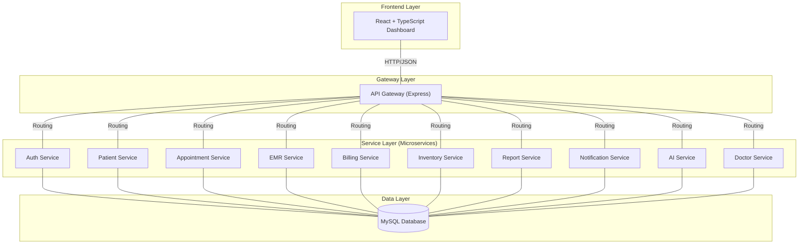

# 🏥 Clinical Hub: Dental Clinic Management System

[](https://nodejs.org/)
[](https://www.mysql.com/)
[](https://www.docker.com/)
[](https://reactjs.org/)

**Clinical Hub** is a robust, microservices-based dental clinic management system designed for scalability, performance, and ease of use. It provides a centralized platform for managing patients, appointments, billing, electronic medical records (EMR), and more.

---

## 🏗 System Architecture

The system follows a modern microservices architecture, leveraging an **API Gateway** as the single entry point for all client communications. This ensures a clean separation of concerns and simplifies frontend integration.

### High-Level Component Diagram



---

## 🚀 Key Features & Services

| Service | Description | Port |
| :--- | :--- | :--- |
| **API Gateway** | Orchestrates routing and acts as the secure entry point. | `5050` |
| **Auth Service** | Handles user authentication, registration, and JWT management. | `5001` |
| **Patient Service**| Comprehensive patient profile and registry management. | `5002` |
| **Appointment** | Advanced scheduling and calendar orchestration. | `5003` |
| **EMR Service** | Management of Electronic Medical Records and dental history. | `5004` |
| **Billing Service**| Invoice generation and payment tracking. | `5005` |
| **AI Service** | Intelligent diagnostics and data analysis. | `5009` |
| **Doctor Service** | Doctor shift management and specialty assignment. | `5010` |

---

## 🔄 Core Data Flow

1.  **Request Initiation**: The React frontend sends a request to the system (e.g., `GET /api/patients`).
2.  **Gateway Routing**: The **API Gateway** (Port 5050) receives the request and identifies the target service based on the path prefix.
3.  **Proxy Forwarding**: Using `http-proxy-middleware`, the Gateway forwards the request to the appropriate internal service (e.g., `patient-service:5002`).
4.  **Business Logic**: The specific microservice processes the request, interacting with the shared MySQL database if necessary.
5.  **Seamless Response**: The result flows back through the Gateway to the Frontend, maintaining a unified API experience for the client.

---

## 🛠 Tech Stack

-   **Frontend**: React, TypeScript, Vite, Tailwind CSS (or Custom CSS)
-   **Backend**: Node.js, Express, Sequelize ORM
-   **Database**: MySQL
-   **Containerization**: Docker, Docker Compose
-   **Communication**: REST APIs (Proxied via Gateway)

---

## 🏁 Getting Started

### Prerequisites

-   [Node.js](https://nodejs.org/) (v16+)
-   [Docker & Docker Compose](https://www.docker.com/products/docker-desktop/) (Recommended)

### The "One-Command" Local Startup (New!)

To start **all** backend services and the frontend at once:
```bash
npm install
npm run dev
```
*(Alternatively, double-click `start-local.bat` windows files)*

---

### Local Manual Startup (Service-by-Service)

If you are not using Docker, follow this specific sequence to ensure services can communicate correctly:

1.  **Step 1: Database**
    - Ensure **MySQL** is running on `localhost:3306`.
    - No need to create databases manually; the microservices will attempt to create `dental_auth_db`, `dental_patient_db`, etc., if they don't exist.

2.  **Step 2: API Gateway (The Entry Point)**
    - This must be started first to route incoming client traffic.
    - ```bash
      cd backend/api-gateway
      npm install
      npm run dev
      ```
    - *Port: 5050*

3.  **Step 3: Core Services (Auth & Patients)**
    - Start the identity and patient management services.
    - ```bash
      # In new terminals:
      npm run dev:auth
      npm run dev:patient
      ```
    - *Ports: 5001, 5002*

4.  **Step 4: Domain Services**
    - Start the remaining logic services.
    - ```bash
      # In new terminals:
      npm run dev:appointment
      npm run dev:emr
      npm run dev:billing
      # ... (repeat for inventory, notification, doctor, ai, etc.)
      ```

5.  **Step 5: Frontend**
    - Finally, start the user interface.
    - ```bash
      npm run dev:frontend
      ```
    - *Port: 5173*


---

## 📄 Documentation

-   [Detailed Architecture Flow](file:///c:/Users/gech/.gemini/antigravity/brain/e6cbd3e0-7817-48f0-83a7-8de03d5cabd5/architecture_flow.md)
-   [Implementation Plan](file:///c:/Users/gech/.gemini/antigravity/brain/e6cbd3e0-7817-48f0-83a7-8de03d5cabd5/implementation_plan.md)

---

Developed with ❤️ by the Clinical Hub Team.
