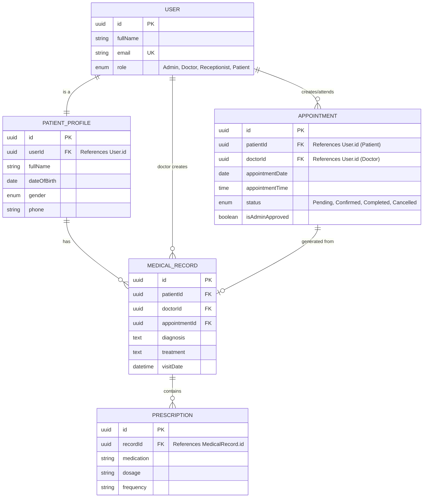

# 📕 Clinical Hub: Comprehensive System Guide

This guide provides a deep dive into the system's operational workflows, database structure, and step-by-step startup procedures.

---

## 🚀 Step-by-Step Startup Guide

### Option 1: Docker (Highly Recommended)
Docker manages all dependencies, networking, and the database automatically.

1.  **Prerequisites**: Install [Docker Desktop](https://www.docker.com/products/docker-desktop/).
2.  **Navigate to Root**: Open your terminal in the `dental-clinic-system` directory.
3.  **Start Services**:
    ```powershell
    docker-compose up --build
    ```
4.  **Verify**:
    - Frontend: `http://localhost:5173`
    - API Gateway: `http://localhost:5050`

---

### Option 2: Manual (Local Development)
Use this if you want to run services individually without Docker.

1.  **Prerequisites**: Install Node.js (v16+) and **MySQL** (v8.0+).
2.  **Setup Database**: Ensure MySQL is running on Port 3306.
3.  **Install Dependencies**:
    ```powershell
    npm install
    ```
4.  **Start Everything (Recommended)**:
    ```powershell
    npm run dev
    ```
    *This uses `concurrently` to start the Gateway, Frontend, and all Microservices in one terminal.*

5.  **Start Individually (Alternative)**:
    - **API Gateway**: `cd backend/api-gateway && npm run dev`
    - **Auth Service**: `npm run dev:auth`
    ... (see README.md for full list)


---

## 📊 Database Schema (ERD)

The system uses **MySQL**. Relationships are maintained cross-service via UUIDs. Each service manages its own specific database (e.g., Auth Service manages `dental_auth_db`).



---

## 🔄 Core System Workflows (Scenarios)

### Scenario A: New Patient Onboarding
1.  **Registration**: A new user registers via the Frontend.
2.  **Auth Service**: Creates a record in the `Users` table with the role `Patient`.
3.  **Patient Service**: Automatically (or via first login) triggers the creation of a `PatientProfile` linked to that `userId`.
4.  **Result**: The user can now view their dashboard and available doctors.

### Scenario B: Booking an Appointment
1.  **Selection**: Patient selects a Doctor and a preferred Date/Time.
2.  **Appointment Service**: Creates an `Appointment` record with status `Pending`.
3.  **Admin Approval**: A user with the `Admin` or `Receptionist` role logs in and approves/confirms the appointment.
4.  **Status Change**: Success! The appointment status moves to `Confirmed`. The Doctor now sees this on their calendar.

### Scenario C: Medical Consultation (EMR)
1.  **Doctor Visit**: During the appointment, the Doctor opens the patient's record.
2.  **EMR Service**: Doctor enters the `Diagnosis` and `Treatment` plan. This creates a `MedicalRecord`.
3.  **Prescription**: If medication is needed, the Doctor adds a `Prescription` linked to that `MedicalRecord`.
4.  **Visibility**: The Patient can now view their consultation history and prescriptions via their dashboard.

### Scenario D: Reporting & Analytics
1.  **Management**: An Admin requests a report on monthly patient visits.
2.  **Report Service**: Aggregates data from `Appointment` and `Patient` services.
3.  **Result**: A PDF or data visualization is generated for administrative review.
### Which services are necessary to start?
To have a **fully functional** project, starting only the Gateway and Frontend is **not enough**. You should start:
1. **API Gateway** (Essential for routing)
2. **Frontend** (The UI)
3. **Auth Service** (Essential for Login/Signup)
4. **Patient Service** (Essential for Patient management)
5. **Appointment Service** (Essential for Booking)
6. **Other Domain Services** (EMR, Billing, Doctor, etc.) as needed for specific features.
